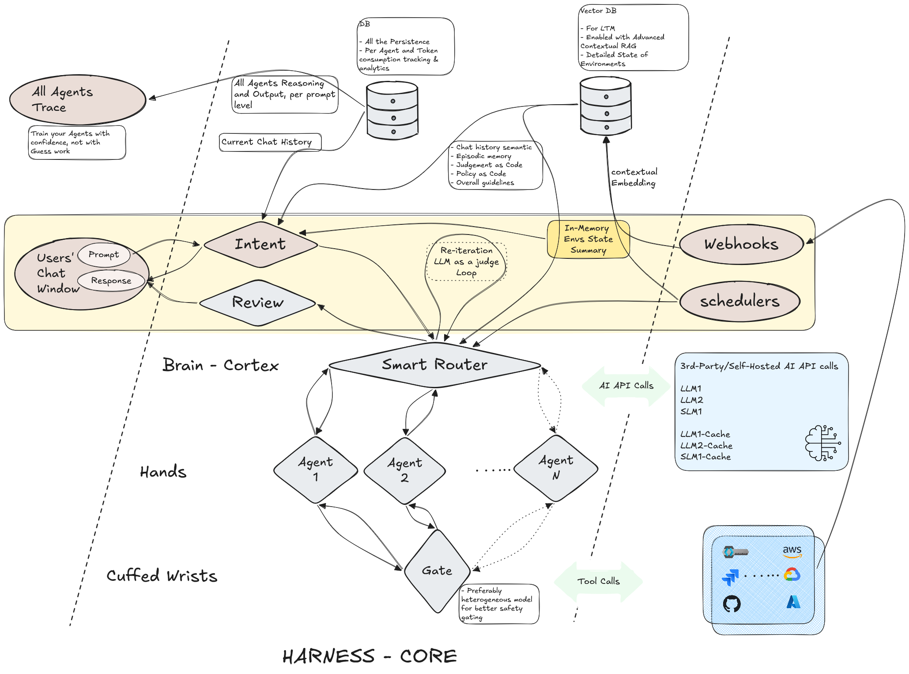
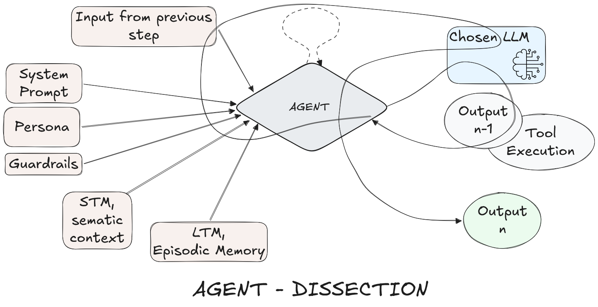

# The New Physics of Harness - Intent focused approach 

This guide outlines a reliable agentic swarm system designed to orchestrate complex operations, such as cloud and infrastructure management. It utilizes a **State-based multi-agent architecture** to interpret user intent, extract required parameters, and delegate tasks to highly specialized agents that enforce strict constraints before any action is executed against live environments.

---

## 🏗 System Architecture & Swarm Topology

The swarm operates in a strict, directed acyclic graph (DAG) pipeline acting as a Harness, utilizing ReAct patterns to separate intent classification, orchestration, and execution into isolated domains.
#### HARNESS CORE (Overview)

It's never Loop vs Graph, it's both.

#### Agent Dissection (Inner Loop)

### 1. Intent Analyzer (Brain - The Hippocampus)
The entry point to the swarm. It runs in two distinct stages to prevent the LLM from guessing or fabricating targets.
While the industry is racing on context engineering, mapping intent is often an ignored topic. However, we can safely consider that Intent and Context are the two strong pillars of a smart harness. 

*   **Stage 1 - Intent Classification:** Classifies the query into `CONTINUATION`, `NEW_TOPIC`, `AMBIGUOUS`, or `IRRELEVANT`. It also performs **Entity Resolution**, expanding user shorthand (e.g., "db") into canonical resource names (e.g., "primary-database-prod-001") by cross-referencing an auto-discovered context or profile summary.
*   **Stage 2 - Dynamic Parameter Mapping:** If the intent is actionable, this stage acts as a hard gate. It dynamically determines the required parameters for the inferred task. If any parameter is missing from the query or conversation history, it short-circuits the graph and generates a composite clarifying question for the user. **Missing means missing—it never hallucinates a default.** 

*Ref: [VISA's VP article: Intent vs Context - The Dual Pillars of High Performance AI Agents](https://medium.com/@pete.cleary_33484/intent-vs-context-the-dual-pillars-of-high-performance-ai-agents-ad618c0279fa)*

**Key Result:** Adding this as a separate node unlocks the opportunity to train this node specific to various verticals and operational procedures without rewriting the entire agentic system. This acts as an abstraction for any industry to customize its own set of internal references apart from industry standards. 

### 2. Supervisor Router (Brain - The Cortex)
If the Intent Analyzer successfully extracts all parameters, it passes the `task_summary`, `required_parameters`, and a hybrid `conversation_history` to the Router. 

*   **Evidence-Based Orchestration:** The Router acts as a Staff Engineer. It never generates final answers based on assumptions or cloud tags. Instead, it formulates a `router_execution_plan` and delegates broken down steps iteratively.
*   **Closed-Loop Supervision:** After a specialist agent executes a command, the Router evaluates the output. If the result is incomplete or blocked, it updates its theory and re-delegates. It only finalizes the response once all real-world evidence proves the user's request is fulfilled. The pre-final stages act as an LLM-as-a-judge. 

**Key Result:** This closed-loop planning, execution delegation in a DAG pattern, and evaluation induces precision in the right direction rather than causing token-exhausting constant chatter between agents. Furthermore, this node acts as a central context pillar, taking a step ahead by embracing the future of 'Codifying the Judgement'.

*Ref: [HUMAIN SVP's blog on Agentic AI](https://www.humain.com/en/blogs/the-new-physics-of-agentic-software-engineering#:~:text=Those%20decisions%20must%20be%20encoded%20directly%20into%20the%20system)* 

### 3. Specialist Agents (The Hands)
Execution is strictly siloed to prevent agents from attempting cross-domain actions.
*   **Agent 1 (`eg: os_engineer`):** Has global SSH access to running VMs. Formulates and owns the execution of local shell commands (`ps`, `docker`, `systemctl`, `ss`). It is the *only* agent permitted to inspect the internal state of a server.
*   **Agent 2 (`eg: cloud_engineer`):** Operates entirely at the Cloud API layer (GCP, AWS, Azure, Kubernetes). Handles public cloud services. It is strictly forbidden from attempting to SSH, but can own the execution of cloud CLI and API calls.
*   **Agent N (`eg: finops_agent`):** The "paranoid CFO" agent, exclusively invoked for billing, cost allocation, and pricing analysis.

**Key Result:** By dissecting the agent into standard inputs and a tool execution loop, we can dynamically swap out LLMs or context payloads (Personas/Guardrails) without rebuilding the agent logic.

### 4. Policy Layer & Security Pipeline (The Cuffed Wrists)
Before any command generated by an agent touches the infrastructure, it passes through the Security Gate & Validator. **This is also the integration point for the Model Context Protocol (MCP), as this is precisely where tool calls are formulated and executed.**
*   **Command Validation (`validator.py`):** Uses regex and AST parsing to detect destructive operations, shell injection patterns, and unapproved arguments.
*   **Heterogeneous LLM Safety Gating:** Preferably, the Security Gate utilizes a *different* LLM provider than the generating agents (e.g., using Claude to judge Gemini's output). This breaks model-specific bias and hallucination alignment, drastically improving safety gating.
*   **Smart Fallback Routing:** If a command is blocked (e.g., an injection attempt), the command is aborted, and the failure is fed back directly to the executing **Agent**. The Agent is explicitly prompted to find an alternative, unblocked diagnostic approach before giving up and escalating the failure back to the Router.

**Key Result:** The actual execution can be risky in terms of reliability and security (especially in case of bad actors), thus a separate policy layer can validate with `APPROVED`, `REJECTED`, or `HITL`, tightening or loosening the cuffs. Furthermore, given the fact we are in an evolving industry, we can extend this to issue Just-in-Time Access Tokens. 
A firm can write its own policy without actually altering all N agents. 

*Ref: [My own comment across a gist](https://gist.github.com/yshaaban/1efa3f2923e871e5b88a4d787a5eec87?permalink_comment_id=6236627#gistcomment-6236627)*

### 5. Review Layer
A dedicated data sanitization phase that acts as the final output boundary. Its primary job is to strip, mask, or block sensitive information before it reaches the chat interfaces. This ensures that sensitive data is not inadvertently shared across systems or permanently revealed in logged chat history.

---

# APPENDIX

## Inspirations:

*   **Overall System:** Inspired by Openclaw's Terminal Access.
*   **Router:** Inspired by DeepSeek's Mixture of Experts.
*   **Vector Embeddings:** Inspired by Anthropic's Contextual RAG.
*   **Intent Layer:** Stemmed from our own experiences interacting with frustrating chatbots.
*   **Gate/Policy Layer:** The regular maker-checker processes we have in ITSM.

## 🧠 Key Design Choices & Lessons Learned

During the development and testing of this architecture, we encountered and resolved several complex architectural challenges regarding agent context, RAG failures, and deployment mitigation.

### 1. Contextual RAG
**The Problem:** In traditional Semantic RAG, when a document is split into smaller chunks, those isolated chunks lose their surrounding context, making them difficult to retrieve accurately.
**The Fix:** We implemented Contextual RAG, which prepends the text chunks with a short summary before generating their embeddings. This restores context and reduces the vector distance between relevant chunks and the user's query.

### 2. Hybrid Context & Explicit Parameter Injection to Prevent Hallucination
**The Problem:** Traditional RAG drops immediately preceding system messages due to semantic drift, and relying on raw conversation history forces the Router to hallucinate missing arguments if it doesn't receive explicitly extracted parameters.
**The Fix:** We implemented a **Hybrid Context Injection** approach. In the Short Term Memory (STM) module, `get_semantic_conversation_context` unconditionally fetches the chronological latest turns to guarantee that critical constraints (e.g., "Do not add the `-a` flag" in the previous step) are never dropped. Furthermore, we decoupled the extraction from the orchestration by explicitly injecting the Intent Analyzer's `task_summary` and `required_parameters` JSON directly into the Router's system prompt payload. This ensures the Router relies strictly on the heavily-gated output rather than making assumptions.

### 3. Agent Containment & The Gatekeeping Dilemma
**The Context:** When building the Security Gate, the primary driver wasn't just zero-trust compliance—it was *reliability* ("Do I actually trust my agent with my will?"). 
**The Architecture:** The `SECURITY_GATE` tail-ends the execution arm. It acts as a leash, evaluating the Router's plan, the agent's proposed command, and Long-Term Memory (LTM) before emitting an `APPROVED` or `REJECTED` decision. We also architected this pipeline to support dynamic `auth_tokens` injected *per-task execution*, rejecting traditional "authenticate and forget" patterns.
**The Policy Design (A/B Testing):** 
Making the policy layer smart requires a delicate balance between security and usability. We A/B tested two approaches for the Security Gate:
*   **Approach A (Explicit Allowlist / Mechanical Bookkeeping):** Extremely restrictive. Resulted in high user friction, degrading the experience to the point where users preferred writing manual scripts over using the agent.
*   **Approach B (Explicit Denylist / Non-touchable Patterns):** Yielded vastly better results. We defaulted to Approach B. While it accepts a calculated degree of over-privilege, this balance is essential for a functional, scalable agentic system.
By treating the Security Gate as a structural choke point, we can continuously audit false positives, trace agent reasoning, and refine our LTM (acting as an Architectural Decision Record) to train the swarm on industry-standard sensitivities.

### 4. AI API Abstraction, Caching & Optimization
**The Architecture:** To maximize performance and reliability, the system integrates a multi-model abstraction layer for all 3rd-party or self-hosted AI API calls (LLM1, LLM2, SLM1). 
**Prompt Caching:** At this layer, large, frequently-used payloads (like the Environment Profile or standard Personas/Guardrails) are managed using prompt caching (`LLM1-Cache`, `SLM1-Cache`). This reduces per-turn latency and token burn significantly.
**Optimization via Model Swapping:** The abstraction layer allows us to independently optimize cost and performance by swapping specific agents with non-frontier LLMs or Small Language Models (SLMs) (e.g., using a smaller model for the OS Engineer while retaining a frontier model for the Supervisor Router).

### 5. Cyclic Multi-Agent Workflows vs. Router-Based DAG
**The Architecture:** We deliberately chose a **Router-Based DAG** over a traditional conversational or cyclic multi-agent workflow (where agents chat back-and-forth indefinitely).
**The Reasoning:** Cyclic workflows often degrade into endless chatter, token exhaustion, and hallucination loops when agents try to mutually agree on a solution without empirical feedback. By implementing a strict DAG supervised by the Router, we created a deterministic state machine. The Router acts as a centralized intelligence—planning, delegating tasks to specialists, evaluating real-world tool outputs as a judge, and orchestrating fallbacks. This tightly bounds the execution, making the swarm significantly safer, more decisive, and ultimately more intelligent.

## Future Expansion
*   **Productization:** Focusing on packaging the system and creating reusable artifacts.
*   **Security:** Implementing Vector DB protection to defend against RAG poisoning attacks.
*   **Configuration:** Externalizing the variables of individual agents for easier dynamic tuning.
*   **Evaluation:** Introducing LLM battling at the router layer to improve output selection.
*   **Market Alternatives:** Several new products in the market now come with built-in MCP and integrated security/policy layers, leveraging these off-the-shelf solutions is a viable future direction.
